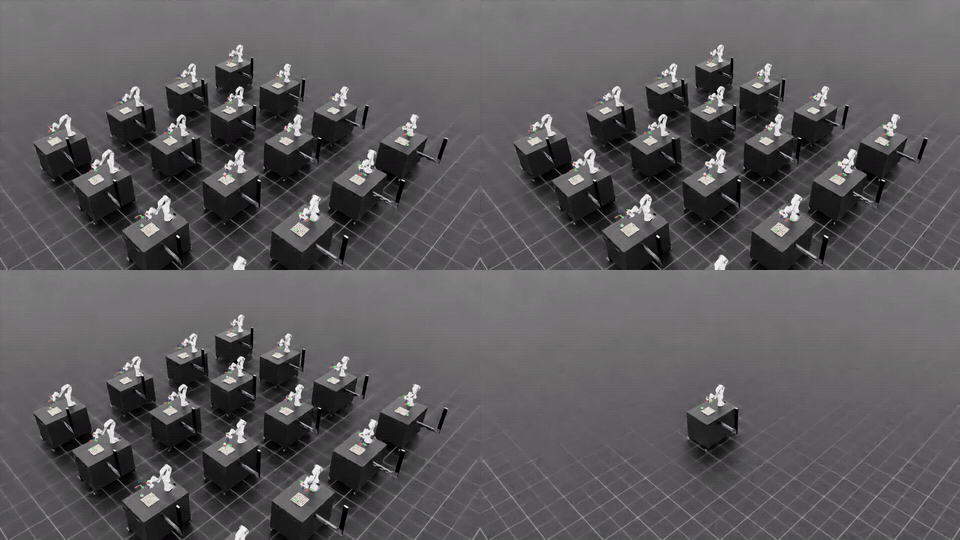

# Cluttered Lift — A Scoped Granular-Manipulation Diagnosis

A small experiment on the [Isaac Lab](https://isaac-sim.github.io/IsaacLab/) +
[`rsl_rl`](https://github.com/leggedrobotics/rsl_rl) PPO stack. The question is
deliberately narrow:

> A PPO policy solves the bare-table `Isaac-Lift-Cube-Franka-v0` task. If the
> cube starts inside a small rigid-body cluster, does standard PPO fail because
> the scene is untrainable, or because a random-init policy cannot bootstrap
> into the first useful reach-and-lift behavior?

This is **act 3** of a three-repo arc:

| Repo | Role |
|---|---|
| [`isaac-lab-manipulation`](https://github.com/Yang251552/isaac-lab-manipulation) | act 1: standard reproduction on the production stack (`Isaac-Lift-Cube-Franka-v0`, 100% over 256 rollouts × 2 seeds) |
| [`excavation-rl`](https://github.com/Yang251552/excavation-rl) | act 2: self-built granular-manipulation substrate (custom Warp + hand-rolled PPO); the engineering load consumed the research budget before the policy converged, kept as a documented lessons-learned artifact |
| this repo | act 3: same granular-manipulation question, re-approached inside the Isaac Lab stack with a small rigid-body proxy — same research taste, different engineering budget |

The point of this repo is **not** "I solved granular pick". The useful output is
a bounded diagnosis: quantified transfer data, one failed from-scratch PPO run,
and two small falsification experiments that separate an optimizer failure from
an exploration-bootstrap failure. In the portfolio story, this is act 2's
lesson applied: keep the granular-manipulation question, but stop spending the
whole budget on custom infrastructure.

## Headline Result

The short version is:

- The act-1 policy transfers surprisingly well at the loose task level:
  **93.36% lift** and **91.02% reach@2cm** over 256 rollouts × 2 seeds.
- Precision still degrades sharply: mean goal distance goes from **3.2 mm** on
  the bare table to **42.1 mm** on the granular scene.
- PPO from scratch, using the same runner config as act 1, collapses to
  **0% / 0% / 0%** on lift / reach@5cm / reach@2cm.
- Removing the curriculum penalty removes the visible iter-425 cliff, but the
  policy still stays at **0% / 0% / 0%**.
- Warm-starting from the act-1 checkpoint changes the outcome completely:
  after 1500 fresh PPO updates on the same substrate, the policy reaches
  **96.29% lift** over 2 eval seeds.

So the claim I would make from this repo is narrow but useful: **PPO can update
a working policy on this contact-rich scene, but it does not find that policy
from random initialization under this reward/configuration.**

## Substrate

The "granular" medium here is a proxy, not real sand or particle physics:

- 64 free rigid spheres via `isaaclab.assets.RigidObjectCollection`
- sphere radius 2.0 cm, mass 5 g, friction 0.5
- 8×8 staggered grid, 4 cm center-to-center, spanning 28 × 28 cm
- grid centered at world `(0.5, 0.0)` with sphere centers at `z = 0.025`
- ±5 mm jitter at episode reset
- cube spawn region inherited unchanged from the base Lift task

The inherited cube spawn range is wider in `y` than the sphere grid. That means
the eval distribution is a mixture: about 56% of episodes start inside the
cluster and about 44% start on mostly bare table. I left this bimodality in
place because it became a useful diagnostic signal rather than a bug to smooth
away.

Implementation lives in [`scripts/granular_lift_env.py`](scripts/granular_lift_env.py).
It registers the training and play variants used by the phase docs.

## Result Table

| Eval | Lift @ 4 cm | Reach @ 5 cm | Reach @ 2 cm | Mean cube z (m) | Mean goal-dist (m) |
|---|---:|---:|---:|---:|---:|
| Bare-table act 1 (256 rollouts × 2 seeds) | 100.00% | 100.00% | 100.00% | 0.382 | 0.0032 |
| Granular zero-shot, act-1 policy (256 × 2 seeds) | 93.36% | 93.16% | 91.02% | 0.346 | 0.0421 |
| Phase 2 retrained, curriculum on (256 × 1 seed) | 0.00% | 0.00% | 0.00% | 0.024 | 0.418 |
| Phase 3 H1 retrained, curriculum off (256 × 1 seed) | 0.00% | 0.00% | 0.00% | 0.022 | 0.440 |
| **Phase 3 H2 warm-start, curriculum off (256 × 2 seeds)** | **96.29%** | **96.09%** | **70.90%** | **0.347** | **0.0366** |

The H2 row is averaged over seed 0 and seed 42. Per-seed values are in
[`docs/phase3-h2-warmstart.md`](docs/phase3-h2-warmstart.md).

## Representative Rollout

Top-left: zero-shot act-1 policy. Top-right: phase-2 retrain with curriculum
on. Bottom-left: phase-3 H1 retrain with curriculum off. Bottom-right:
phase-3 H2 warm-start with curriculum off.

The visual pattern matches the table. Zero-shot and H2 usually lift the cube
through the sphere cluster. The two from-scratch policies mostly leave the cube
near the table.

## Diagnosis

Phase 1 shows that the scene is not impossible. The bare-table policy loses
about 7 percentage points of lift success and 9 points of reach@2cm, but it
still lifts most cubes. The bigger warning sign is precision: mean goal
distance grows from 3.2 mm to 42.1 mm. I read that as a tail effect more than a
uniform degradation, especially because the spawn distribution mixes
inside-cluster and outside-cluster starts.

Phase 2 asks whether PPO can learn the same substrate from scratch with the
same recipe that worked in act 1. It cannot. Around iter 425 the `action_rate`
and `joint_vel` curriculum schedules finish ramping, the mean reward curve
falls sharply, and the actor settles into a low-motion policy. By eval time the
cube is basically still at table height (`mean cube z = 0.024 m`) and far from
the goal (`mean goal-dist = 0.418 m`).

That failure made the curriculum look guilty, so H1 removed the two curriculum
schedules. This falsified the simple story. The iter-425 cliff disappeared, but
there was no learning trajectory underneath it: mean reward stayed near its
initial value, lift reward stayed flat, and eval still ended at 0% across all
thresholds. The curriculum was making the failure dramatic; it was not the
structural cause.

H2 then changed only the initialization. Starting from act 1's `model_1499.pt`,
PPO survived 1500 fresh updates on the same NoCurric task and ended at 96.29%
lift. This is the key contrast. The optimizer is not inherently destroying
policies on the granular scene; a working policy can remain on the task
manifold and keep receiving useful gradients. The hard part is getting onto
that manifold from random initialization.

There is one caveat I would not want to hide: H2 improves lift success but
hurts the tight reach metric, dropping reach@2cm from 91.02% in zero-shot to
70.90% after warm-start fine-tuning. My current guess is that the policy
reweights toward "lift and keep the cube" under contact noise, while precise
settling near the goal becomes less reliable. I have not yet verified that with
per-episode inside/outside-cluster labels, so I would treat this as a plausible
reading, not a finished explanation.

## What I'd Try Next

The next experiment I would actually spend budget on is a **substrate
curriculum**. Start with zero spheres on the table, so the random-init policy is
training on the act-1 bare-table task, then grow the sphere density linearly
over the first ~500 iterations until it reaches the locked 64-sphere grid. H2
already says PPO can stay on the task manifold once it is there. This would
test whether a gradual substrate makes random-init PPO enter that manifold
without needing a separately trained teacher checkpoint.

I would also split H2 eval by spawn type: inside the sphere grid vs outside it.
Phase 1 estimated the distribution as roughly 56% inside-cluster and 44%
outside-cluster, but the eval logs do not report those buckets separately. That
matters because the 20-point reach@2cm drop in H2 may not be a general
precision loss. It might be concentrated almost entirely in the inside-cluster
episodes, while outside-cluster behavior stays close to the bare-table policy.
Those two interpretations point to different follow-up experiments.

What I would avoid, at least in this repo, is reward shaping around sphere
motion or contact pattern. It might help performance, but it changes the problem
definition and weakens the comparison to the act-1 zero-shot baseline. This repo
is more useful as a fixed-substrate diagnosis than as another round of shaping
until the curve looks good.

## Method Discipline

The work was phase-gated on purpose. Each phase had a stop point, a short output
doc, and a time cap. Long training runs were inspected mid-run so a clearly
failed policy could be stopped early instead of burning the full GPU budget.

That discipline is part of the result. The negative runs are not throwaway
failures; they are the evidence that lets H1 and H2 mean something.

## Phase Docs

| Phase | Doc | One-line result |
|---|---|---|
| 0 | [`docs/phase0-substrate-decision.md`](docs/phase0-substrate-decision.md) | Substrate: 64 spheres × 2 cm × 8×8 grid via `RigidObjectCollection` |
| 1 | [`docs/phase1-zero-shot-transfer.md`](docs/phase1-zero-shot-transfer.md) | Zero-shot: lift drops 100% → 93.36%, mean goal-dist degrades 13× |
| 2 | [`docs/phase2-train-from-scratch.md`](docs/phase2-train-from-scratch.md) | From-scratch PPO with curriculum collapses to 0% |
| 3 H1 | [`docs/phase3-h1-no-curriculum.md`](docs/phase3-h1-no-curriculum.md) | Curriculum off still ends at 0%; H1 falsified |
| 3 H2 | [`docs/phase3-h2-warmstart.md`](docs/phase3-h2-warmstart.md) | Warm-start reaches 96.29% lift; H2 supported |

## Why a Rigid-Body Proxy?

A real continuous granular bed would require particle physics, either PhysX PBD
particles or a custom Warp implementation. That was the act-2 direction, and it
blew out the engineering budget before producing a clean learning signal.

For this act, the question is smaller: what happens when the cube's contacts
resolve through many movable bodies instead of one hard table? A rigid-body
sphere cluster is not sand, but it is enough to create the contact-rich failure
mode this repo studies. That is the scope cut.

## Sibling Repos

- **Act 1** — [`isaac-lab-manipulation`](https://github.com/Yang251552/isaac-lab-manipulation): standard `Isaac-Lift-Cube-Franka-v0` reproduction. Provides the bare-table baseline and the `model_1499.pt` checkpoint used for H2.
- **Act 2** — [`excavation-rl`](https://github.com/Yang251552/excavation-rl): self-built granular-excavation substrate with custom Warp particle physics and hand-rolled PPO. The engineering load consumed the research budget before the policy converged; kept as an engineering lessons-learned artifact. This repo is the same research interest brought back inside the production stack.
