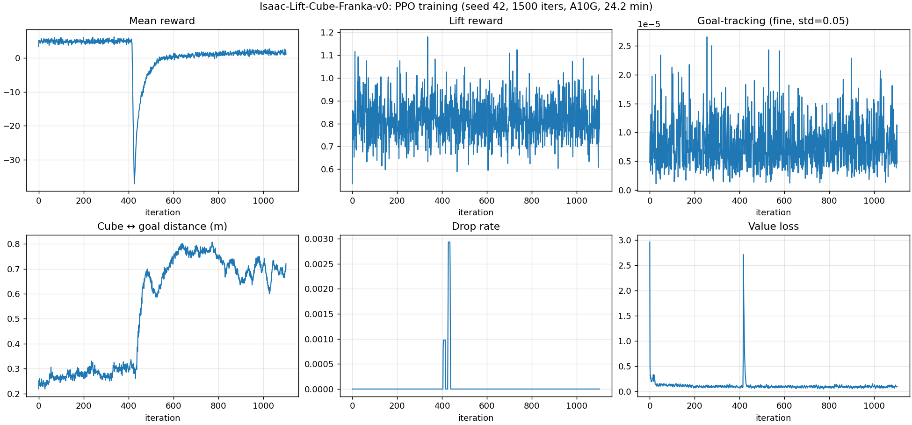

# Phase 2 — Train PPO from Scratch on the Cluttered Scene

**Time spent: ≈58 min training (stopped early at iter 1100/1500 per
[CLAUDE.md §2.1](../CLAUDE.md), mid-train inspection rule).**

## Configuration

Identical to act-1's `LiftCubePPORunnerCfg`. Nothing tuned. The point of
phase 2 is "what does the same recipe do on the cluttered substrate", not
"how can we make PPO win here".

| Field | Value |
|---|---|
| Algorithm | PPO via `rsl_rl` 5.0.1 |
| Network | actor / critic MLP `[256, 128, 64]`, ELU |
| `num_envs` | 1024 (down from act-1's 4096; PhysX patch buffer overflow above this) |
| `num_steps_per_env` | 24 |
| `max_iterations` | 1500 (configured); stopped at 1100 |
| Learning rate | 1e-4, adaptive |
| Other PPO | clip 0.2, ent 0.006, γ 0.98, λ 0.95, target KL 0.01 |
| Curriculum | `joint_vel`, `action_rate` weight schedules from base Lift cfg, unchanged |
| Wandb run | https://wandb.ai/yangchenghan2515-eth-z-rich/granular-pick/runs/6ud7bffx |

## Why we stopped at iter 1100

[CLAUDE.md §2.1](../CLAUDE.md) requires a halfway-point inspection on any
training run longer than 30 min. At iter 734 the run already met **all four**
of the early-stop criteria:

- Mean reward at iter 59 was 5.5; at iter 734 it was 1.5. Policy got worse, not better.
- `Episode_Reward/lifting_object` was below 1.0 and trending flat.
- Curriculum penalties on `joint_vel` and `action_rate` had stabilised at large negative values (`−0.5` and `−0.7` respectively after their iter-425 dive).
- The reward signal was pure noise around the post-collapse baseline.

Continuing to iter 1500 would have produced ≈58 min of additional training for an unchanged answer.

## Results — three-way comparison

| Eval | Lift @ 4 cm | Reach @ 5 cm | Reach @ 2 cm | Mean cube z (m) | Mean goal-dist (m) |
|---|---|---|---|---|---|
| Bare-table act-1 | 100.00% | 100.00% | 100.00% | 0.382 | 0.0032 |
| Granular zero-shot (act-1 policy) | 94.53% | 94.14% | 92.58% | 0.352 | 0.0374 |
| **Granular trained from scratch** | **0.00%** | **0.00%** | **0.00%** | **0.024** | **0.418** |

Mean cube z = 0.024 m means the cube is sitting at table level. The trained
policy does not lift it. Mean goal-dist = 0.418 m means the cube is more or less
where it spawned, untouched. The 0% across all three success criteria is not a
"barely missing" failure. The policy actively avoids moving.

## What happened in training (read with the curve panel below)

> Note: the suptitle on this PNG is hardcoded from the act-1 plot script
> ("PPO training, seed 42, 1500 iters, A10G, 24.2 min"). For phase 2 it should
> read `1100 iters / ~58 min`. TODO: parameterise `scripts/plot_training_curves.py`
> to take a `--title` arg.

Reading the curves left-to-right, top-to-bottom:

1. **Mean reward**: hovers around 5–10 for the first 400 iters. At iter ~425 it dives to −30. By iter ~600 it climbs back to ~0 and then plateaus. It never rises above its initial value again.

2. **Lift reward**: noisy in the 0.6–1.2 band the entire run. The cube does briefly clear 4 cm in some envs at any given iter — but that is sphere physics knocking it up, not the gripper lifting it. The policy never separates lifted-by-policy from knocked-up-by-spheres.

3. **Goal-tracking fine (std=0.05)**: scale 1e-5. Pure noise. The policy never gets the cube close enough to the goal for the fine-grained tanh kernel to register anything.

4. **Cube ↔ goal distance**: starts ~0.3 m, drifts up to ~0.8 m around the iter-425 collapse, then settles ~0.6 m. After training the cube is on average *further* from the goal than it would be if the robot did nothing, because the robot's flailing during the collapse phase pushed cubes off the table.

5. **Drop rate**: ~0 throughout. The policy isn't dropping cubes because it never grasps them in the first place.

6. **Value loss**: a single sharp spike at iter ~425 (the collapse), then drops to a low-noise floor. The critic gives up trying to predict reward once the actor settles into "don't move".

The whole story is in panel 1's iter-425 cliff. Up to that point the actor was attempting reaches (panel 1's `reaching_object` reward in the wandb dashboard climbed to a small peak ~0.03 over iter 0–400). At iter 425 the curriculum schedule for `joint_vel` and `action_rate` kicked in hard, and the resulting penalty was an order of magnitude larger than any reach reward the actor was earning. PPO's adaptive learning rate, plus the KL-clipped surrogate, then pushed the policy toward "minimise penalty" — which means "don't move". Once the actor stopped trying to reach, all task rewards went silent, the curriculum penalty stayed bounded at its plateau value, and the policy was stable at a degenerate local minimum.

## Two falsification experiments for phase 3

The diagnosis above gives two concrete, **non-reward-shaping** experiments
that phase 3 can run, each producing a falsifiable answer:

**H1 — "the curriculum penalty is the actor-killer"**
Disable the `joint_vel` and `action_rate` curriculum schedules (set their max weight to the base value, no ramp). Re-run phase 2 training. If mean reward now climbs and lifts succeed, H1 is supported. If the policy still collapses, H1 is falsified and the cause is upstream of curriculum.

**H2 — "exploration bootstrap fails on cluttered substrate, but a warmed-up policy survives"**
Re-run phase 2 training but initialise weights from the act-1 `model_1499.pt` checkpoint (the one that hits 92.58% zero-shot). If the policy fine-tunes upward toward 100% under continued PPO updates, H2 is supported. If it collapses to the same degenerate "don't move" minimum, H2 is falsified and the issue is structural to the curriculum / reward, not to the random init.

Both fit inside the act-3 disciplines (no reward shaping, still PPO via rsl_rl). Phase 3 picks one or both, time-boxed at 4 h total.

## Visualization

Side-by-side: zero-shot act-1 policy on the left, trained-on-cluttered policy
on the right. Same 16 parallel envs, same scene, same 12 s window. Left side
the cubes are being lifted and pushed through the cluster. Right side the
policy is essentially still.

Full mp4 at [`results/videos/granular_before_after.mp4`](../results/videos/granular_before_after.mp4).

## Eval log

[`results/logs/phase2_trained_seed0.log`](../results/logs/phase2_trained_seed0.log)

## Artefacts

- `results/checkpoints/granular_seed42_model_1100.pt` (gitignored, kept locally)
- `results/tfevents/granular_seed42/events.out.tfevents.*` (gitignored)
- `configs/granular_pick/{agent,env}.yaml` (the resolved configs the run actually used)

> **TODO (human): research observation paragraph.**
>
> Two or three sentences in your own voice on what the curriculum-collapse
> story tells you about how to design RL pipelines for contact-rich tasks,
> and which of H1 / H2 you find more interesting (and why). Same rule as
> phase 1: this is the part PIs read for research taste, and it has to
> sound like the person who ran the experiment.
