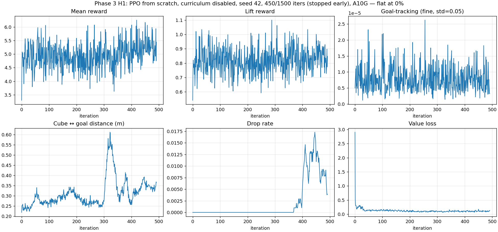

# Phase 3, H1 — Curriculum Disabled

**Hypothesis**: the policy collapse observed in phase 2 at iter 425 is caused by
the `action_rate` and `joint_vel` curriculum schedules ramping their reward
weights from −0.0001 to −0.1 over the first ~10 000 env-steps. If we keep
those weights at their base value, PPO should be able to learn.

**Verdict: falsified.**

## What we changed

`GranularFrankaCubeLiftEnvCfg_NoCurric` (in `scripts/granular_lift_env.py`)
subclasses the phase-2 cluttered config and removes the two curriculum terms in
`__post_init__`:

```python
delattr(self.curriculum, "action_rate")
delattr(self.curriculum, "joint_vel")
```

Everything else is identical to phase 2: 1024 envs, same PPO config from
`LiftCubePPORunnerCfg`, same 64-sphere on-table grid substrate.

## Training

| Field | Value |
|---|---|
| Iterations completed | 450 / 1500 (stopped early per CLAUDE.md §2.1) |
| Wallclock | 37 min |
| Final mean reward | ~5.0 (oscillating 4–5.5 the entire run) |
| Final lift reward | ~0.8 (flat) |
| Wandb run | https://wandb.ai/yangchenghan2515-eth-z-rich/granular-pick/runs/5smdr3j3 |

Stopping rule fired by iter ~450:

- Mean reward at iter 59 was 5.5; at iter 450 it was 5.0. Flat for the entire run.
- Lift reward stayed below 1.0 throughout.
- Reward signal was pure noise around its initial value.

## Curves



> Note: hardcoded suptitle still says act-1's "1500 iters, 24.2 min". Same
> issue as phase 2's curve PNG. TODO: parameterise the plot script.

The phase-2 cliff at iter ~425 is gone (no curriculum to ramp), but there is
no replacement learning trajectory. Mean reward, lift reward, and goal-tracking
fine all stay at their iter-0 levels. Cube-to-goal distance drifts upward over
the run (from ~0.30 to ~0.40), meaning the cube is on average farther from the
goal at the end of training than at the start.

## Eval — four-row comparison

| Eval | Lift @ 4 cm | Reach @ 5 cm | Reach @ 2 cm | Mean cube z (m) | Mean goal-dist (m) |
|---|---|---|---|---|---|
| Bare-table act-1 | 100.00% | 100.00% | 100.00% | 0.382 | 0.0032 |
| Granular zero-shot (act-1 policy) | 94.53% | 94.14% | 92.58% | 0.352 | 0.0374 |
| Phase 2 retrained (curriculum on) | 0.00% | 0.00% | 0.00% | 0.024 | 0.418 |
| **Phase 3 H1 retrained (curriculum off)** | **0.00%** | **0.00%** | **0.00%** | **0.022** | **0.440** |

H1 collapsed to the same 0% as phase 2 but via a different path. Phase 2 the
policy briefly tried, the curriculum penalty crushed it at iter 425, and it
settled at "don't move". H1 the policy never tried in the first place: with
the penalty ramp gone, there was no force pushing it toward the degenerate
fixed point, but there was also no useful gradient pulling it toward task
success.

## Three-panel comparison

Left: zero-shot act-1 policy (92.58% reach@2cm).
Middle: phase-2 retrained policy at iter 1100 (curriculum on, 0%).
Right: phase-3 H1 retrained policy at iter 450 (curriculum off, 0%).


## What this rules out

The curriculum schedule is **not** the actor-killer in the structural sense.
It made the phase-2 collapse visible (the iter-425 cliff in the reward curve),
but the underlying inability to learn was already there before the curriculum
weights ramped. Disabling the schedule produces a stationary "do nothing"
policy that looks different from the phase-2 collapse on the curve, but is
functionally identical: 0% / 0% / 0% on eval, cube essentially untouched.

## What this implies for H2

The remaining viable hypothesis from phase 2's diagnosis is **exploration
bootstrap**: random-init PPO cannot find the gradient direction that leads
toward the lift-and-place behaviour when the contact pattern around the cube
includes the sphere cluster. The reward signal that the actor would need to
follow (reaching reward, lift reward) is too noisy under sphere contacts to
provide a useful training signal from scratch.

H2 tests this by warm-starting from the act-1 checkpoint, which already
encodes the "reach, grasp, lift" structure on bare table. If a policy that
*can* lift the cube on the cluttered scene (even at a degraded 92.58%) is
allowed to fine-tune under continued PPO updates, it has a reward signal that
is actually informative — every successful lift produces a clear gradient.

If H2 also collapses to 0%, the conclusion strengthens: not even a warmed-up
policy can survive PPO updates on this substrate, which would point to
something more fundamental than exploration (advantage estimation under
non-stationary contacts, surrogate-loss instability under noisy rewards, etc.).

## Eval log

[`results/logs/phase3_h1_nocurric_seed0.log`](../results/logs/phase3_h1_nocurric_seed0.log)

## Artefacts

- `results/checkpoints/h1_nocurric_seed42_model_450.pt` (gitignored, kept locally)
- `results/tfevents/h1_nocurric/events.out.tfevents.*` (gitignored)
- `configs/h1_nocurric/{agent,env}.yaml`
- `results/videos/h1_nocurric_seed42.{mp4,gif}`
- `results/videos/h1_three_panel.{mp4,gif}`

## What I take away from H1 being falsified

The thing I want to write down before I forget is that going into H1 I would have told someone that the iter-425 cliff in phase 2 was *the cause* of the policy collapse — that is what the curve looked like and that is the most visually salient feature of the run. H1 disabling the curriculum schedule and still ending at 0% was honestly more useful than I expected, because the H1 curve has no cliff, no dramatic feature, just a flat 5.0 ± 0.5 mean reward for 450 iters. Same final eval, same "do nothing" policy, but now there is no curriculum penalty to blame. That collapses my mental model in a useful way: the iter-425 cliff was the symptom that made the failure visible, not the mechanism that produced the failure. The mechanism is something earlier — something that means a random-init policy on this substrate cannot find a useful reward gradient even when nothing is actively pushing it away from one.

I think for reward design the lesson I want to draw is that on a contact-rich substrate the diagnostic question to ask first is not "are the auxiliary penalties tuned right" but "is the task reward dense enough to outvote a network's noise floor at random init". Phase 2 framed the question as the first one, and H1 has shown me the question was wrong. I am still not 100% sure whether the right reframing is "the lift reward is too sparse" or "the reaching reward is too noisy under sphere contacts" — both could produce the same H1 curve, and I do not have a clean experiment in this repo that separates them. If I had more budget I would actually want to run H1 with a *dense* version of the lift reward (a continuous height bonus instead of the 0.04-m threshold) to see whether the policy starts moving — that is the experiment I am most curious about, but it falls outside the act-3 reward-shaping prohibition, so I am explicitly not running it here. H2 is the in-budget version of the same question and that is what I am going to do next.
