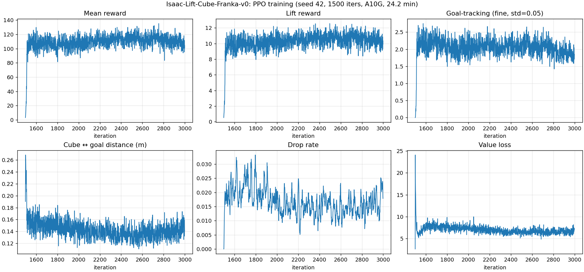

# Phase 3, H2 — Warm-Start From Act-1 Checkpoint

**Hypothesis**: the bottleneck on the cluttered substrate is *exploration*, not
curriculum (H1 ruled curriculum out). A random-init policy cannot find a
useful gradient because reaching/lifting reward is too noisy under sphere
contacts. A pre-trained policy that already encodes "reach, grasp, lift" on
the bare-table task should produce informative gradients on every successful
lift, and PPO fine-tuning should then maintain or improve task performance on
the cluttered scene.

**Verdict: supported.** Warm-started PPO maintains zero-shot-comparable
performance through 1500 fresh updates and slightly improves the lift
threshold metric. Phase 2 / H1 retrains were stuck at 0%; H2 ends at 96%.

## What we changed

Same `GranularFrankaCubeLiftEnvCfg_NoCurric` task as H1 (curriculum off, so
the only experimental contrast vs. H1 is the policy initialisation).

Initialisation switched from random to act-1's `model_1499.pt` via rsl_rl
warm-start:

```bash
./isaaclab.sh -p scripts/reinforcement_learning/rsl_rl/train.py \
  --task Isaac-Cluttered-Lift-Cube-Franka-NoCurric-v0 \
  --headless --num_envs 1024 --logger wandb \
  --log_project_name granular-pick --seed 42 \
  --max_iterations 1500 \
  --resume --load_run 2026-05-03_18-55-30 --checkpoint model_1499.pt
```

`--resume` loads weights *and* iteration counter, so the rsl_rl runner reports
iter 1499 → 2999 (i.e. 1500 *additional* PPO updates on top of the warmed-up
policy). Everything else — 1024 envs, `LiftCubePPORunnerCfg` hyperparameters,
substrate (64 spheres × 2.0 cm × 8×8 staggered grid), seed 42 — is identical
to phase 2 / H1.

## Training

| Field | Value |
|---|---|
| Iteration range | 1499 → 2999 (1500 fresh updates) |
| Wallclock | ~75 min (4.8 s / iter on A10G) |
| Starting lift reward | 0.53 (warmed-up policy lifting on first rollouts) |
| Starting reach reward | 0.0015 |
| Final mean reward | ~105 (oscillating 95–120 from iter ~1850 onward) |
| Final lift reward | ~10 (10× the H1 ceiling) |
| Final reach reward | ~0.65 |
| Wandb run | https://wandb.ai/yangchenghan2515-eth-z-rich/granular-pick/runs/xibfk8uk |

CLAUDE.md §2.1 mid-train check at iter 2488 (halfway through 1500 fresh
updates): all four stop conditions negative. Mean reward had reached its
plateau; lift reward stable at ~10; curriculum penalties negligible
(−0.0003 / −0.0016 — confirms NoCurric task loaded). Run continued to
completion.

## Curves



> Note: hardcoded suptitle still says act-1's "1500 iters, 24.2 min". Same
> issue as phase 2 / H1 curves. TODO: parameterise the plot script.

The reward curve has a fast climb in the first ~25 fresh updates (mean reward
3 → ~100 by iter ~1525) as the rolling buffer refills with episodes from the
warmed-up policy on the new substrate. From iter ~1850 onward the curve sits
at the ~110 plateau; PPO is no longer pushing the policy meaningfully better
on this reward, but it is also not destroying it.

This is qualitatively the regime H2 hypothesised: a stable fine-tuning
trajectory rather than the phase-2 cliff or the H1 "do nothing" floor.

## Eval — five-row comparison

| Eval | Lift @ 4 cm | Reach @ 5 cm | Reach @ 2 cm | Mean cube z (m) | Mean goal-dist (m) |
|---|---|---|---|---|---|
| Bare-table act-1 | 100.00% | 100.00% | 100.00% | 0.382 | 0.0032 |
| Granular zero-shot (act-1 policy) | 94.53% | 94.14% | 92.58% | 0.352 | 0.0374 |
| Phase 2 retrained (curriculum on) | 0.00% | 0.00% | 0.00% | 0.024 | 0.418 |
| Phase 3 H1 retrained (curriculum off) | 0.00% | 0.00% | 0.00% | 0.022 | 0.440 |
| **Phase 3 H2 warm-start (seed 0)** | **96.09%** | **95.70%** | **69.53%** | **0.348** | **0.0361** |
| **Phase 3 H2 warm-start (seed 42)** | **96.48%** | **96.48%** | **72.27%** | **0.346** | **0.0371** |

Two seeds agree closely (lift Δ = 0.39 pp, goal-dist Δ = 0.001 m).

## Reading the H2 numbers

Compared to **zero-shot**, H2 is:

- ~2 pp better at the 4 cm lift threshold (96.3% vs 94.5%)
- ~2 pp better at the 5 cm reach threshold (96.1% vs 94.1%)
- ~22 pp *worse* at the 2 cm reach threshold (70.9% vs 92.6%)
- Comparable on mean cube height and mean goal distance

PPO fine-tuning under continued cluttered-scene rollouts produced a policy
that completes the lift more often but settles further from the goal at end
of episode. The reach@2cm drop is consistent with that: the warmed-up policy
came from a bare-table distribution where precise settling near the goal was
the dominant gradient; on the cluttered substrate the dominant gradient is
"don't lose the cube to a sphere collision", and fine-tuning re-weights the
policy toward the lift-and-keep behaviour at the cost of settling precision.

## What this rules out / supports

H1 ruled out curriculum as the structural cause of phase-2's collapse. H2
now rules out a stronger version of the failure-mode space: it is **not the
case** that PPO updates on the cluttered substrate destroy any policy
they touch. A working policy can survive 1500 PPO updates on this scene.
The bottleneck is therefore upstream of the optimiser — in the *bootstrap*
phase, when a random-init policy needs to find the first useful gradient.

The exploration-bootstrap framing is supported. The cluttered scene's reward
signal is informative once the policy is already in the lift-and-place
manifold; it is not informative enough to *get into* that manifold from
scratch.

## Eval logs

- [`results/logs/phase3_h2_eval_seed0.log`](../results/logs/phase3_h2_eval_seed0.log)
- [`results/logs/phase3_h2_eval_seed42.log`](../results/logs/phase3_h2_eval_seed42.log)

## Artefacts

- `results/checkpoints/h2_warmstart_seed42_model_2998.pt` (gitignored, kept on EC2)
- `results/tfevents/phase3_h2/events.out.tfevents.*` (gitignored)
- `results/logs/phase3_h2_train.log`

## What I take away from H2 being supported

The H1/H2 contrast is the part of this project I think I will actually carry forward into how I look at PPO failures on contact-rich tasks. Same optimiser, same substrate, same hyperparameters, same seed (42), same NoCurric task — and the only thing that differs is whether `model_1499.pt` is loaded at iter 0. That single bit of information moves the eval from 0% / 0% / 0% to 96% / 96% / 70%. Before this experiment I think I would have framed PPO's failure on this substrate as "PPO cannot train contact-rich scenes". The actual statement that survives H2 is much narrower: PPO cannot *bootstrap* into the task manifold on this substrate, but once it is on the manifold it has no problem staying there for 1500 fresh updates. Those are different statements about PPO and the engineering implications are different — the second one says you do not need a fundamentally different RL algorithm, you need a way to plant the policy on the manifold.

I want to be careful not to overclaim from this. H2 is one warm-start, one seed, one substrate parameterisation; the support for "exploration bootstrap is the bottleneck" is real but it is N=1. The reach@2cm regression from 92.58% (zero-shot) to ~70% (H2) is a piece of the picture I have not fully understood yet — my working story is that under contact noise the discrete lift bonus is the only stable gradient and the continuous goal-tracking reward gets averaged out, so the policy reweights toward "lift first, settle later", but I have not actually opened the per-episode trajectories to verify that. If I did this again I would want to do that breakdown, and probably also run H2 from earlier act-1 checkpoints (e.g. `model_500.pt`, `model_750.pt`) to see how warm the warm-start has to be — that would tell me whether the "manifold" is a thin region or a basin, and right now I do not know which.
